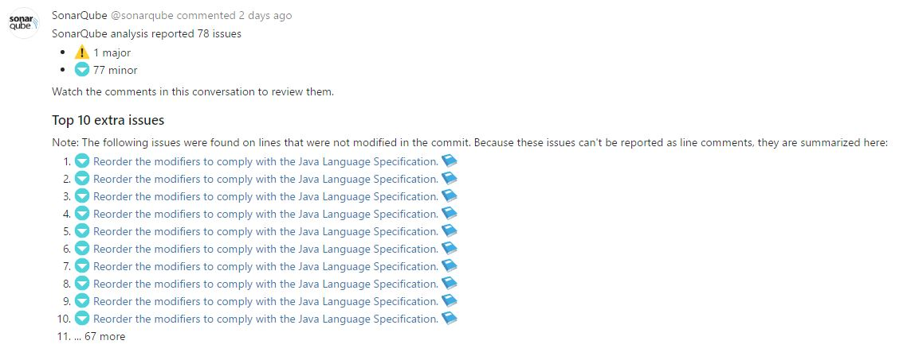
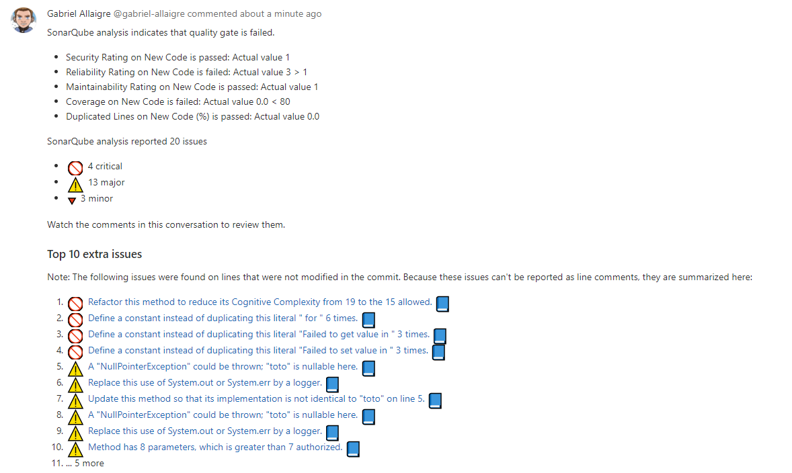
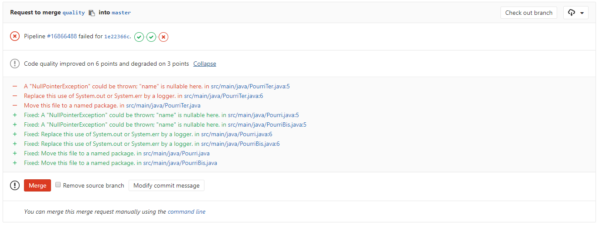
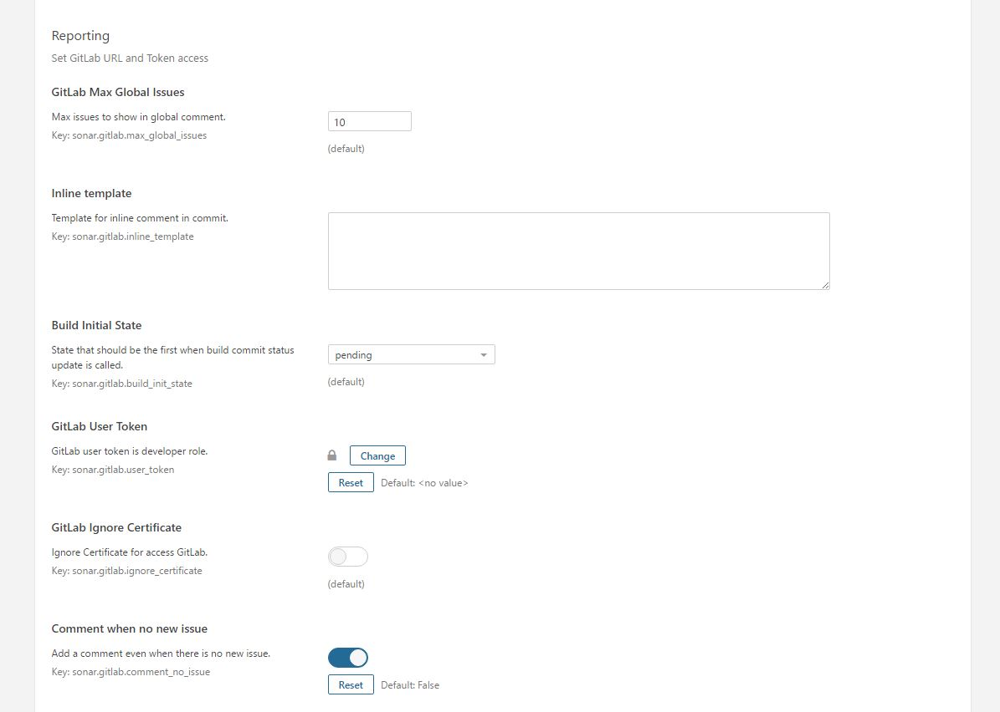
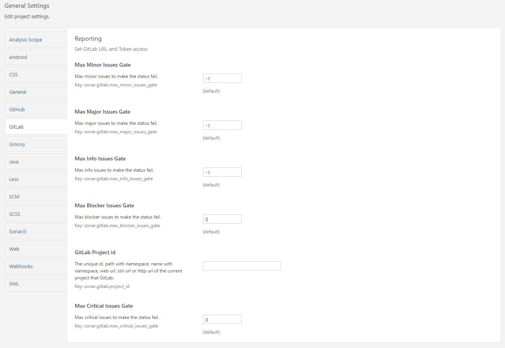

Sonar GitLab Plugin
===================

[](https://travis-ci.org/gabrie-allaigre/sonar-gitlab-plugin)

Inspired by https://github.com/SonarCommunity/sonar-github

# Changelog

## Version 4.0.0

### Changed
- Update to sonarqube 7.0 plugin version

### Fixed
- Using properties instead of depending on the deprecated, work with SonarQube 7.2 [#164](https://github.com/gabrie-allaigre/sonar-gitlab-plugin/pull/164) (Thanks dmarin)
- Fix others deprecated
- Fix sonar issues limit 10000 [#140](https://github.com/gabrie-allaigre/sonar-gitlab-plugin/issues/140)
- Fix disable proxy if proxy is enable in system [#168](https://github.com/gabrie-allaigre/sonar-gitlab-plugin/issues/168)

**[Download 4.0.0](https://github.com/gabrie-allaigre/sonar-gitlab-plugin/releases/download/4.0.0/sonar-gitlab-plugin-4.0.0.jar)**

## Version 3.0.2

### Changed
- Only for SonarQube 6.7

### Fixed
- Fix sonar issues limit 10000 [#140](https://github.com/gabrie-allaigre/sonar-gitlab-plugin/issues/140)
- Add test for covorage

**[Download 3.0.2](https://github.com/gabrie-allaigre/sonar-gitlab-plugin/releases/download/3.0.2/sonar-gitlab-plugin-3.0.2.jar)** 

## Version 3.0.1

### Changed
- Support unit test sources #104
- Show user token in project config #89

### Fixed
- Fix bug with QualityGate status NONE #107

**[Download 3.0.1](https://github.com/gabrie-allaigre/sonar-gitlab-plugin/releases/download/3.0.1/sonar-gitlab-plugin-3.0.1.jar)** 

## Version 3.0.0

**This version is directly in the SonarQube update center**

### Changed
- Api v4 is now default value
- For publish mode, get quality gate and print in global comment
- For publish mode, get all new issues and print in inline and global comment
- For publish mode, build breaker (status or exit) if quality gate is error or warn (option)
- Add json report for GitLab EE, codeclimate or sast
- Add filter for issues
- Add information rule by issue

### Removed
- Plugin property sonar.gitlab.ref. The property is replaced by sonar.gitlab.ref_name

**[Download 3.0.0](https://github.com/gabrie-allaigre/sonar-gitlab-plugin/releases/download/3.0.0/sonar-gitlab-plugin-3.0.0.jar)** 

## Version 2.1.0

### Changed
- Add commit only line
- Add prefix workspace (not found .git folder)
- Support v3 & v4 api for GitLab
- Add all issues options

**[Download 2.1.0](https://github.com/gabrie-allaigre/sonar-gitlab-plugin/releases/download/2.1.0/sonar-gitlab-plugin-2.1.0.jar)**

## Version 2.0.1

### Fixed
- Fixbug : NoClassDefFoundError with internal sonar class #26

**[Download 2.0.1](https://github.com/gabrie-allaigre/sonar-gitlab-plugin/releases/download/2.0.1/sonar-gitlab-plugin-2.0.1.jar)**

## Version 2.0.0

### Changed
- Use emoticon (Thanks Artpej)
- Change fail rule (Thanks Artpej)
- Add comment for no issue (Thanks frol2103)
- Refactored code (Thanks johnou)
- Disable reporting in global comments
- Disable reporting in inline comments
- Add support Proxy
- Ignore certficate if auto-signed 
- Custom global comment (Template)
- Custom inline comment (Template)
- Get multi SHA for comment inline all commits
- Custom comment maybe empty then no comment added
- Add test unit
- Add quality project https://sonarqube.com/dashboard?id=com.talanlabs%3Asonar-gitlab-plugin
- GitLab API is in maven central
- Java 8
- Sonarqube >= 5.6
- Remove personal repository

# Goal

Add to each **commit** GitLab in a global commentary on the new anomalies added by this **commit** and add comment lines of modified files.

**Comment commits:**



**Comment line:**


**Add build line:**


**With quality gate global comment**



**With generate code quality json file**



**With generate SAST json file**


Works with Java, Php, Android, JavaScript, C#, etc..

# Usage

For SonarQube < 5.4:

- Download last version https://github.com/gabrie-allaigre/sonar-gitlab-plugin/releases/download/1.6.6/sonar-gitlab-plugin-1.6.6.jar
- Copy file in extensions directory `SONARQUBE_HOME/extensions/plugins`
- Restart SonarQube 

For SonarQube >= 5.4 and < 5.6:

- Download last version https://github.com/gabrie-allaigre/sonar-gitlab-plugin/releases/download/1.7.0/sonar-gitlab-plugin-1.7.0.jar
- Copy file in extensions directory `SONARQUBE_HOME/extensions/plugins`
- Restart SonarQube

For SonarQube >= 5.6 and < 6.7:

- Download last version https://github.com/gabrie-allaigre/sonar-gitlab-plugin/releases/download/3.0.1/sonar-gitlab-plugin-3.0.1.jar
- Copy file in extensions directory `SONARQUBE_HOME/extensions/plugins`
- Restart SonarQube

For SonarQube >= 6.7 and < 7.0:

- Download last version https://github.com/gabrie-allaigre/sonar-gitlab-plugin/releases/download/3.0.2/sonar-gitlab-plugin-3.0.2.jar
- Copy file in extensions directory `SONARQUBE_HOME/extensions/plugins`
- Restart SonarQube

For SonarQube >= 7.0:

- Download last version https://github.com/gabrie-allaigre/sonar-gitlab-plugin/releases/download/4.0.0/sonar-gitlab-plugin-4.0.0.jar
- Copy file in extensions directory `SONARQUBE_HOME/extensions/plugins`
- Restart SonarQube

**Optional Plugin: [Add Single Sign-On with GitLab in SonarQube](https://github.com/gabrie-allaigre/sonar-auth-gitlab-plugin)**

## Command line

Example:

### Issues mode (Preview) 

With Maven

```shell
mvn --batch-mode verify sonar:sonar -Dsonar.host.url=$SONAR_URL -Dsonar.login=$SONAR_LOGIN -Dsonar.analysis.mode=preview -Dsonar.gitlab.commit_sha=$CI_COMMIT_SHA -Dsonar.gitlab.ref_name=$CI_COMMIT_REF_NAME -Dsonar.gitlab.project_id=$CI_PROJECT_ID
```

or for comment inline in all commits of branch:

```shell
mvn --batch-mode verify sonar:sonar -Dsonar.host.url=$SONAR_URL -Dsonar.login=$SONAR_LOGIN -Dsonar.analysis.mode=preview -Dsonar.gitlab.commit_sha=$(git log --pretty=format:%H origin/master..$CI_COMMIT_SHA | tr '\n' ',') -Dsonar.gitlab.ref_name=$CI_COMMIT_REF_NAME -Dsonar.gitlab.project_id=$CI_PROJECT_ID -Dsonar.gitlab.unique_issue_per_inline=true 
```

With SonarScanner

```shell
sonar-scanner -Dsonar.host.url=$SONAR_URL -Dsonar.login=$SONAR_LOGIN -Dsonar.analysis.mode=preview -Dsonar.gitlab.commit_sha=$CI_COMMIT_SHA -Dsonar.gitlab.ref_name=$CI_COMMIT_REF_NAME -Dsonar.gitlab.project_id=$CI_PROJECT_ID
```

With SonarScanner and node

```shell
npm run sonar-scanner -- -Dsonar.host.url=$SONAR_URL -Dsonar.login=$SONAR_LOGIN -Dsonar.analysis.mode=preview -Dsonar.gitlab.commit_sha=$CI_COMMIT_SHA -Dsonar.gitlab.ref_name=$CI_COMMIT_REF_NAME -Dsonar.gitlab.project_id=$CI_PROJECT_ID
```

With Gradle

```shell
./gradlew sonarqube -Dsonar.host.url=$SONAR_URL -Dsonar.login=$SONAR_LOGIN -Dsonar.analysis.mode=preview -Dsonar.gitlab.commit_sha=$CI_COMMIT_SHA -Dsonar.gitlab.ref_name=$CI_COMMIT_REF_NAME -Dsonar.gitlab.project_id=$CI_PROJECT_ID
```

### Publish mode (Analyse)

With Maven

```shell
mvn --batch-mode verify sonar:sonar -Dsonar.host.url=$SONAR_URL -Dsonar.login=$SONAR_LOGIN -Dsonar.gitlab.commit_sha=$CI_COMMIT_SHA -Dsonar.gitlab.ref_name=$CI_COMMIT_REF_NAME -Dsonar.gitlab.project_id=$CI_PROJECT_ID -Dsonar.branch.name=$CI_COMMIT_REF_NAME
```

Works with `sonar-scanner` and `gradle`

## GitLab CI

> Set secret variable `SONAR_URL` and `SONAR_LOGIN`

.gitlab-ci.yml sample for Maven project, comment last commit:

```yml
sonarqube_master_job:
  stage: test
  only:
    - master
  script:
    - mvn --batch-mode verify sonar:sonar -Dsonar.host.url=$SONAR_URL -Dsonar.login=$SONAR_LOGIN

sonarqube_preview_feature_job:
  stage: test
  only:
    - /^feature\/*/
  script:
    - git checkout origin/master
    - git merge $CI_COMMIT_SHA --no-commit --no-ff
    - mvn --batch-mode verify sonar:sonar -Dsonar.host.url=$SONAR_URL -Dsonar.login=$SONAR_LOGIN -Dsonar.analysis.mode=preview -Dsonar.gitlab.project_id=$CI_PROJECT_PATH -Dsonar.gitlab.commit_sha=$CI_COMMIT_SHA -Dsonar.gitlab.ref_name=$CI_COMMIT_REF_NAME
```

With quality gate

```yml
sonarqube_master_job:
  stage: test
  only:
    - master
  script:
    - mvn --batch-mode verify sonar:sonar -Dsonar.host.url=$SONAR_URL -Dsonar.login=$SONAR_LOGIN -Dsonar.gitlab.project_id=$CI_PROJECT_PATH -Dsonar.gitlab.commit_sha=$CI_COMMIT_SHA -Dsonar.gitlab.ref_name=$CI_COMMIT_REF_NAME

sonarqube_preview_feature_job:
  stage: test
  only:
    - /^feature\/*/
  script:
    - git checkout origin/master
    - git merge $CI_COMMIT_SHA --no-commit --no-ff
    - mvn --batch-mode verify sonar:sonar -Dsonar.host.url=$SONAR_URL -Dsonar.login=$SONAR_LOGIN -Dsonar.analysis.mode=preview -Dsonar.gitlab.project_id=$CI_PROJECT_PATH -Dsonar.gitlab.commit_sha=$CI_COMMIT_SHA -Dsonar.gitlab.ref_name=$CI_COMMIT_REF_NAME
```

If use SonarQube with `BranchPlugin`

```yml
sonarqube_master_job:
  stage: test
  only:
    - master
  script:
    - mvn --batch-mode verify sonar:sonar -Dsonar.host.url=$SONAR_URL -Dsonar.login=$SONAR_LOGIN -Dsonar.gitlab.project_id=$CI_PROJECT_PATH -Dsonar.gitlab.commit_sha=$CI_COMMIT_SHA -Dsonar.gitlab.ref_name=$CI_COMMIT_REF_NAME

sonarqube_preview_feature_job:
  stage: test
  only:
    - /^feature\/*/
  script:
    - git checkout origin/master
    - git merge $CI_COMMIT_SHA --no-commit --no-ff
    - mvn --batch-mode verify sonar:sonar -Dsonar.host.url=$SONAR_URL -Dsonar.login=$SONAR_LOGIN -Dsonar.gitlab.project_id=$CI_PROJECT_PATH -Dsonar.gitlab.commit_sha=$CI_COMMIT_SHA -Dsonar.gitlab.ref_name=$CI_COMMIT_REF_NAME -Dsonar.branch.name=$CI_COMMIT_REF_NAME
```

For get code quality (`codeclimate.json`) in merge request (only GitLab EE https://docs.gitlab.com/ee/user/project/merge_requests/code_quality_diff.html)

> Warning, master must have a `codequality.json`, use `commit-status` for notification mode (not mandatory)

```yml
stages:
  ...
  - test
  - quality
  ...
sonarqube_master_job:
  stage: test
  only:
    - master
  script:
    - mvn --batch-mode verify sonar:sonar -Dsonar.host.url=$SONAR_URL -Dsonar.login=$SONAR_LOGIN -Dsonar.gitlab.project_id=$CI_PROJECT_PATH -Dsonar.gitlab.commit_sha=$CI_COMMIT_SHA -Dsonar.gitlab.ref_name=$CI_COMMIT_REF_NAME -Dsonar.gitlab.json_mode=CODECLIMATE -Dsonar.gitlab.failure_notification_mode=commit-status  
  artifacts:
    expire_in: 1 day
    paths:
      - codeclimate.json

sonarqube_preview_feature_job:
  stage: test
  only:
    - /^feature\/*/
  script:
    - git checkout origin/master
    - git merge $CI_COMMIT_SHA --no-commit --no-ff
    - mvn --batch-mode verify sonar:sonar -Dsonar.host.url=$SONAR_URL -Dsonar.login=$SONAR_LOGIN -Dsonar.analysis.mode=preview -Dsonar.gitlab.project_id=$CI_PROJECT_PATH -Dsonar.gitlab.commit_sha=$CI_COMMIT_SHA -Dsonar.gitlab.ref_name=$CI_COMMIT_REF_NAME -Dsonar.gitlab.json_mode=CODECLIMATE -Dsonar.gitlab.failure_notification_mode=commit-status
  artifacts:
    expire_in: 1 day
    paths:
      - codeclimate.json

codequality:
  stage: quality
  variables:
    GIT_STRATEGY: none
  script:
    - echo ok
  artifacts:
    paths:
      - codeclimate.json
```

For get SAST (`gl-sast-report.json`) information in merge request (only GitLab EE https://docs.gitlab.com/ee/user/project/merge_requests/sast.html)

```yml
stages:
  ...
  - test
  - quality
  ...
sonarqube_preview_feature_job:
  stage: test
  only:
    - /^feature\/*/
  script:
    - git checkout origin/master
    - git merge $CI_COMMIT_SHA --no-commit --no-ff
    - mvn --batch-mode verify sonar:sonar -Dsonar.host.url=$SONAR_URL -Dsonar.login=$SONAR_LOGIN -Dsonar.analysis.mode=preview -Dsonar.gitlab.project_id=$CI_PROJECT_PATH -Dsonar.gitlab.commit_sha=$CI_COMMIT_SHA -Dsonar.gitlab.ref_name=$CI_COMMIT_REF_NAME -Dsonar.gitlab.json_mode=SAST -Dsonar.gitlab.failure_notification_mode=commit-status
  artifacts:
    expire_in: 1 day
    paths:
      - gl-sast-report.json

sast:
  stage: quality
  only:
    - /^feature\/*/
  variables:
    GIT_STRATEGY: none
  artifacts:
    paths:
      - gl-sast-report.json
```

| GitLab 8.x name | GitLab 9.x name |
| -------- | ----------- |
| CI_BUILD_REF | CI_COMMIT_SHA |
| CI_BUILD_REF_NAME | CI_COMMIT_REF_NAME |

https://docs.gitlab.com/ce/ci/variables/#9-0-renaming

## Plugins properties

| Variable | Comment | Type | Version |
| -------- | ----------- | ---- | --- |
| sonar.gitlab.url | GitLab url | Administration, Variable | >= 1.6.6 |
| sonar.gitlab.max_global_issues | Maximum number of anomalies to be displayed in the global comment |  Administration, Variable | >= 1.6.6 |
| sonar.gitlab.user_token | Token of the user who can make reports on the project, either global or per project |  Administration, Project, Variable | >= 1.6.6 |
| sonar.gitlab.project_id | Project ID in GitLab or internal id or namespace + name or namespace + path or url http or ssh url or url or web | Project, Variable | >= 1.6.6 |
| sonar.gitlab.commit_sha | SHA of the commit comment | Variable | >= 1.6.6 |
| sonar.gitlab.ref | Branch name or reference of the commit | Variable | < 3.0.0 |
| sonar.gitlab.ref_name | Branch name or reference of the commit | Variable | >= 1.6.6 |
| sonar.gitlab.max_blocker_issues_gate | Max blocker issue for build failed (default 0). Note: only for preview mode | Project, Variable | >= 2.0.0 |
| sonar.gitlab.max_critical_issues_gate | Max critical issues for build failed (default 0). Note: only for preview mode | Project, Variable | >= 2.0.0 |
| sonar.gitlab.max_major_issues_gate | Max major issues for build failed (default -1 no fail). Note: only for preview mode | Project, Variable | >= 2.0.0 |
| sonar.gitlab.max_minor_issues_gate | Max minor issues for build failed (default -1 no fail). Note: only for preview mode | Project, Variable | >= 2.0.0 |
| sonar.gitlab.max_info_issues_gate | Max info issues for build failed (default -1 no fail). Note: only for preview mode | Project, Variable | >= 2.0.0 |
| sonar.gitlab.ignore_certificate | Ignore Certificate for access GitLab, use for auto-signing cert (default false) | Administration, Variable | >= 2.0.0 |
| sonar.gitlab.comment_no_issue | Add a comment even when there is no new issue (default false) | Administration, Variable | >= 2.0.0 |
| sonar.gitlab.disable_inline_comments | Disable issue reporting as inline comments (default false) | Administration, Variable | >= 2.0.0 |
| sonar.gitlab.only_issue_from_commit_file | Show issue for commit file only (default false) | Variable | >= 2.0.0 |
| sonar.gitlab.only_issue_from_commit_line | Show issue for commit line only (default false) | Variable | >= 2.1.0 |
| sonar.gitlab.build_init_state | State that should be the first when build commit status update is called (default pending) | Administration, Variable | >= 2.0.0 |
| sonar.gitlab.disable_global_comment | Disable global comment, report only inline (default false) | Administration, Variable | >= 2.0.0 |
| sonar.gitlab.failure_notification_mode | Notification is in current build (exit-code) or in commit status (commit-status) (default commit-status) | Administration, Variable | >= 2.0.0 |
| sonar.gitlab.global_template | Template for global comment in commit | Administration, Variable | >= 2.0.0 |
| sonar.gitlab.ping_user | Ping the user who made an issue by @ mentioning. Only for default comment (default false) | Administration, Variable | >= 2.0.0 |
| sonar.gitlab.unique_issue_per_inline | Unique issue per inline comment (default false) | Administration, Variable | >= 2.0.0 |
| sonar.gitlab.prefix_directory | Add prefix when create link for GitLab | Variable | >= 2.1.0 |
| sonar.gitlab.api_version | GitLab API version (default `v4` or `v3`) | Administration, Variable | >= 2.1.0 |
| sonar.gitlab.all_issues | All issues new and old (default false, only new) | Administration, Variable | >= 2.1.0 |
| sonar.gitlab.json_mode | Create a json report in root for GitLab EE (codeclimate.json or gl-sast-report.json) | Project, Variable | >= 3.0.0 |
| sonar.gitlab.query_max_retry | Max retry for wait finish analyse for publish mode | Administration, Variable | >= 3.0.0 |
| sonar.gitlab.query_wait | Max retry for wait finish analyse for publish mode | Administration, Variable | >= 3.0.0 |
| sonar.gitlab.quality_gate_fail_mode | Quality gate fail mode: error or warn (default error) | Administration, Variable | >= 3.0.0 |
| sonar.gitlab.issue_filter | Filter on issue, if MAJOR then show only MAJOR, CRITICAL and BLOCKER (default INFO) | Administration, Variable | >= 3.0.0 |
| sonar.gitlab.load_rules | Load rules for all issues (default false) | Administration, Variable | >= 3.0.0 |
| sonar.gitlab.disable_proxy | Disable proxy if system contains proxy config (default false) | Administration, Variable | >= 4.0.0 |

- Administration : **Settings** globals in SonarQube
- Project : **Settings** of project in SonarQube
- Variable : In an environment variable or in the `pom.xml` either from the command line with` -D`

# Configuration

- In SonarQube: Administration -> General Settings -> GitLab -> **Reporting**. Set GitLab Url and Token

> If sonar.gitlab.failure_notification_mode is commit-status then role is Developer else Reporter.



- In SonarQube: Project Administration -> General Settings -> GitLab -> **Reporting**. Set project identifier in GitLab



# Templates

Custom global/inline comment : Change language, change image, change order, print all issues, etc

**Use FreeMarker syntax [http://freemarker.org/](http://freemarker.org/)**

## Variables

Usage : `${name}`

| name | type | description |
| --- | --- | --- |
| url | String | GitLab url |
| projectId | String | Project ID in GitLab or internal id or namespace + name or namespace + path or url http or ssh url or url or web |
| commitSHA | String[] | SHA of the commit comment. Get first `commitSHA[0]` |
| refName | String | Branch name or reference of the commit |
| maxGlobalIssues | Integer | Maximum number of anomalies to be displayed in the global comment |
| maxBlockerIssuesGate | Integer | Max blocker issue for build failed |
| maxCriticalIssuesGate | Integer | Max critical issue for build failed |
| maxMajorIssuesGate | Integer | Max major issue for build failed |
| maxMinorIssuesGate | Integer | Max minor issue for build failed |
| maxInfoIssuesGate | Integer | Max info issue for build failed |
| disableIssuesInline | Boolean | Disable issue reporting as inline comments |
| disableGlobalComment | Boolean | Disable global comment, report only inline |
| onlyIssueFromCommitFile | Boolean | Show issue for commit file only |
| commentNoIssue | Boolean | Add a comment even when there is no new issue |
| revision | String | Current revision |
| author | String | Commit's author for inline |
| lineNumber | Integer | Current line number for inline issues only |
| BLOCKER | Severity | Blocker |
| CRITICAL | Severity | Critical |
| MAJOR | Severity | Major |
| MINOR | Severity | Minor |
| INFO | Severity | Info |
| sonarUrl | String | Url of SonarQube |
| publishMode | Boolean | true if publish mode |
| qualityGate | QualityGate | QualityGate |
| OK | Status | Passed QualityGate & Condition status only Global Comment |
| WARN | Status | Warning QualityGate & Condition status only Global Comment |
| ERROR | Status | Failed QualityGate & Condition status only Global Comment |
| CODE_SMELL | Rule Type | Code smell |
| BUG | Rule Type | Bug |
| VULNERABILITY | Rule Type | Vulnerability |

## Functions

Usage : `${name(arg1,arg2,...)}`

| name | arguments | type | description |
| --- | --- | --- | --- |
| issueCount | none | Integer | Get new issue count |
| issueCount | Boolean | Integer | Get new issue count if true only reported else false only not reported |
| issueCount | Severity | Integer | Get new issue count by Severity |
| issueCount | Boolean, Severity | Integer | Get new issue count by Severity if true only reported else false only not reported |
| issues | none | List<Issue> | Get new issues |
| issues | Boolean | List<Issue> | Get new issues if true only reported else false only not reported |
| issues | Severity | List<Issue> | Get new issues by Severity |
| issues | Boolean, Severity | List<Issue> | Get new issues by Severity if true only reported else false only not reported |
| print | Issue | String | Print a issue line (same default template) |
| emojiSeverity | Severity | String | Print a emoji by severity |
| imageSeverity | Severity | String | Print a image by severity |
| ruleLink | String | String | Get URL for rule in SonarQube |

Usage : `${qualityGate.name(arg1,arg2,...)}`

| name | arguments | type | description |
| --- | --- | --- | --- |
| conditions | Function none argument | List<Condition> | Get all conditions |
| conditions | Function Status argument | List<Condition> | Get all conditions with Status|
| conditionCount | Function none argument | Integer | Get size of all conditions |
| conditionCount | Function Status argument | Integer | Get size conditions with Status|

### Types 

Usage : `${Issue.name}`

| name | type | description |
| --- | --- | --- |
| reportedOnDiff | Boolean | Reported inline |
| url | String | URL of file/line in GitLab |
| componentKey | String | Component key |
| severity | Severity | Severity of issue |
| line | Integer | Line (maybe null) |
| key | String | Key |
| message | String | Message (maybe null) |
| ruleKey | String | Rule key on SonarQube |
| new | Boolean | New issue |
| ruleLink | String | URL of rule in SonarQube |
| src | String | File source |
| rule | Rule | Rule information |

Usage : `${Issue.rule.name}`

| name | type | description |
| --- | --- | --- |
| key | String | Rule key |
| repo | String | Rule repository |
| name | String | Name of rule |
| description | String | Description of rule |
| type | Type | CODE_SMELL, BUG, VULNERABILITY |
| debtRemFnType | String | Debt type |
| debtRemFnBaseEffort | String | Debt effort |

Usage : `${qualityGate.name}`

| name | type | description |
| --- | --- | --- |
| status | Status | Status of quality gate |

Usage : `${Condition.name}`

| name | type | description |
| --- | --- | --- |
| status | Status | Status of condition |
| actual | String | Actual value for metric |
| warning | String | Warning value |
| error | String | Error value |
| metricKey | String | Metric key |
| metricName | String | Metric name |
| symbol | String | Symbol of condition <,>,=,!= |

## Examples

### Global

```injectedfreemarker
<#if qualityGate??>
SonarQube analysis indicates that quality gate is <@s status=qualityGate.status/>.
<#list qualityGate.conditions() as condition>
<@c condition=condition/>

</#list>
</#if>
<#macro c condition>* ${condition.metricName} is <@s status=condition.status/>: Actual value ${condition.actual} is ${condition.symbol}<#if condition.status != OK && condition.message?? && condition.message?trim?has_content> (${condition.message})</#if></#macro>
<#macro s status><#if status == OK>passed<#elseif status == WARN>warning<#elseif status == ERROR>failed<#else>unknown</#if></#macro>
<#assign newIssueCount = issueCount() notReportedIssueCount = issueCount(false)>
<#assign hasInlineIssues = newIssueCount gt notReportedIssueCount extraIssuesTruncated = notReportedIssueCount gt maxGlobalIssues>
<#if newIssueCount == 0>
SonarQube analysis reported no issues.
<#else>
SonarQube analysis reported ${newIssueCount} issue<#if newIssueCount gt 1>s</#if>
    <#assign newIssuesBlocker = issueCount(BLOCKER) newIssuesCritical = issueCount(CRITICAL) newIssuesMajor = issueCount(MAJOR) newIssuesMinor = issueCount(MINOR) newIssuesInfo = issueCount(INFO)>
    <#if newIssuesBlocker gt 0>
* ${emojiSeverity(BLOCKER)} ${newIssuesBlocker} blocker
    </#if>
    <#if newIssuesCritical gt 0>
* ${emojiSeverity(CRITICAL)} ${newIssuesCritical} critical
    </#if>
    <#if newIssuesMajor gt 0>
* ${emojiSeverity(MAJOR)} ${newIssuesMajor} major
    </#if>
    <#if newIssuesMinor gt 0>
* ${emojiSeverity(MINOR)} ${newIssuesMinor} minor
    </#if>
    <#if newIssuesInfo gt 0>
* ${emojiSeverity(INFO)} ${newIssuesInfo} info
    </#if>
    <#if !disableIssuesInline && hasInlineIssues>

Watch the comments in this conversation to review them.
    </#if>
    <#if notReportedIssueCount gt 0>
        <#if !disableIssuesInline>
            <#if hasInlineIssues || extraIssuesTruncated>
                <#if notReportedIssueCount <= maxGlobalIssues>

#### ${notReportedIssueCount} extra issue<#if notReportedIssueCount gt 1>s</#if>
                <#else>

#### Top ${maxGlobalIssues} extra issue<#if maxGlobalIssues gt 1>s</#if>
                </#if>
            </#if>

Note: The following issues were found on lines that were not modified in the commit. Because these issues can't be reported as line comments, they are summarized here:
        <#elseif extraIssuesTruncated>

#### Top ${maxGlobalIssues} issue<#if maxGlobalIssues gt 1>s</#if>
        </#if>

        <#assign reportedIssueCount = 0>
        <#list issues(false) as issue>
            <#if reportedIssueCount < maxGlobalIssues>
1. ${print(issue)}
            </#if>
            <#assign reportedIssueCount++>
        </#list>
        <#if notReportedIssueCount gt maxGlobalIssues>
* ... ${notReportedIssueCount-maxGlobalIssues} more
        </#if>
    </#if>
</#if>
```

**Others examples for global :**
- [Template Default](templates/global/default.md) Current template
- [Template Default with Images](templates/global/default-image.md) Same template as default but with images
- [Template All Issues](templates/global/all-issues.md) Print all issues

### Inline

```injectedfreemarker
<#list issues() as issue>
<@p issue=issue/>
</#list>
<#macro p issue>
${emojiSeverity(issue.severity)} ${issue.message} [:blue_book:](${issue.ruleLink})
</#macro>
```

**Others examples for inline :**
- [Template Default](templates/inline/default.md) Current template
- [Template Default with Images](templates/inline/default-image.md) Same template as default but with images


# Tips


## Import GitLab SSL certifcate

- **On your server** import Gitlab SSL certificate into the JRE used by SonarQube

If you don't already have you certificate on the SonarQube server, run `openssl s_client -connect mygitlab.com:443 -showcerts > /home/${USER}/mygitlab.crt`

Import it into your JRE cacerts (you can check from the "System Info" page in the Administration section of your sonarqube instance), running `sudo $JDK8/bin/keytool -import -file ~/mygitlab.crt -keystore $JDK8/jre/lib/security/cacerts -alias mygitlab`.

Restart your SonarQube instance.

## Make it works with a private project
- On a private project, with the provided command line upper in this document, you'll got an "IllegalStateException: Unable found project for" Exception.
- It's necessary to create a "Personal Access Tokens". It needs a user with the "developper" right in the project. The token can be created in the profile menu, check the api checkbox. 
- Then, use the following command line to run sonar thought gitlab-ci 

``` batch
mvn --batch-mode verify sonar:sonar
      -Dsonar.gitlab.api_version=v4
      -Dsonar.host.url=http://<your_sonar_url>:9000
      -Dsonar.login=<your_sonar_login>
      -Dsonar.analysis.mode=preview
      -Dsonar.gitlab.commit_sha=$CI_COMMIT_SHA
      -Dsonar.gitlab.ref_name=$CI_COMMIT_REF_NAME
      -Dsonar.gitlab.project_id=$CI_PROJECT_ID
      -Dsonar.gitlab.url=http://<your_gitlab_url>
      -Dsonar.gitlab.user_token=<your_user_token>
```


## Version 3.1.0-SNAPSHOT

- UP to Sonarqube API 7.0
